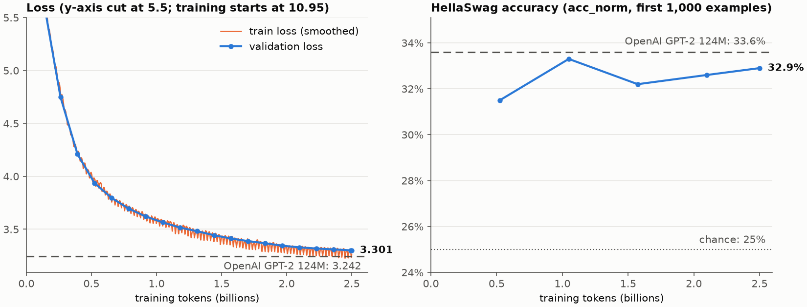

# GPT-2 (124M) from scratch

A PyTorch reproduction of GPT-2 small (124M parameters), trained from scratch (random
initialisation) on 2.5 billion tokens of FineWeb-Edu on a single 6GB laptop GPU, then
fine-tuned into a chatbot that runs entirely in your web browser. With OpenAI's released
weights loaded, the implementation reproduces the reference GPT-2's logits to within 7e-5.

**[Try the chatbot in your browser](https://zuu007-gpt2-from-scratch.static.hf.space)** ·
[Hugging Face Space](https://huggingface.co/spaces/zuu007/gpt2-from-scratch) ·
weights: [base](https://huggingface.co/zuu007/gpt2-from-scratch),
[chat](https://huggingface.co/zuu007/gpt2-from-scratch-chat) ·
[](https://github.com/zuurashad/gpt2-from-scratch/actions/workflows/tests.yml)

<!-- RESULTS:START -->
## Results

The run took 4,768 steps of 524,288 tokens: **2.5B tokens of FineWeb-Edu, one pass with
no token repeated**. It took **33.7 GPU-hours** on an RTX 4050 Laptop GPU (6GB), at a
median of 20.6k tokens/s. A reboot part-way through was resumed from the step-2,750
checkpoint.

| | this model | OpenAI GPT-2 124M |
|---|---|---|
| validation loss (FineWeb-Edu, the same 409,600 held-out tokens, fp32) | 3.300 | 3.242 |
| HellaSwag (`acc_norm`, all 10,042) | 27.03% | 29.55% |
| ARC-Easy (`acc_norm`) | 42.30% | 38.17% |

<picture>
  <source media="(prefers-color-scheme: dark)" srcset="assets/training_dark.png">
  
</picture>

Its 2.5B tokens are a quarter of Karpathy's 10B reference run.
- **Behind OpenAI's GPT-2:** slightly, on validation loss and HellaSwag. LAMBADA, which
  predicts the last word of a long passage, is the clearest gap.
- **Ahead:** on ARC-Easy and Winogrande.

Every benchmark below uses the same harness ([`evals.py`](evals.py), zero-shot, fp32) for
both models. Raw results: [`results/`](results).

| benchmark | metric | this model | OpenAI GPT-2 124M | examples |
|---|---|---|---|---|
| HellaSwag | acc_norm | 27.03% | 29.55% | 10,042 |
| ARC-Easy | acc_norm | 42.30% | 38.17% | 2,376 |
| ARC-Challenge | acc_norm | 23.21% | 22.95% | 1,172 |
| PIQA | acc_norm | 60.45% | 61.81% | 1,838 |
| OpenBookQA | acc_norm | 27.00% | 27.20% | 500 |
| Winogrande | acc_norm | 52.96% | 51.62% | 1,267 |
| BoolQ | acc_norm | 52.19% | 48.64% | 3,269 |
| LAMBADA | acc | 20.80% | 32.56% | 5,153 |
| LAMBADA | perplexity | 81.1 | 18.0 | 5,153 |

BoolQ is below the 62% you'd get by always answering "yes" for both models, so it says
little at this size.

### The chat model

Supervised fine-tuning on `databricks-dolly-15k`:
- **Data:** 14,517 training conversations and 296 held out. 198 examples longer than
  1,024 tokens were dropped rather than truncated.
- **Training:** 3 epochs (1,359 steps, 32 conversations each), learning rate 3e-5.
- **Result:** validation loss on the held-out answers of **2.654**.

Unedited replies from the in-browser (int8) chat model at the page's default settings:

> **What is the capital of France?**
> Paris

> **Give me three tips for staying focused while studying.**
> 1. Use a focus journal to keep your mind active
> 2. Use a computer to practice concentration
> 3. Avoid distractions like phone calls or screens

> **Explain what a neural network is in two sentences.**
> A neural network is a type of machine learning. A neural network is a machine learning
> model that can learn from data and improve on it. Neural networks are very useful
> because they provide data- and-information based services, which can be used for
> training and evaluation.

At 124M parameters it follows the format, answers simple questions and stops when it's
done. Beyond that it is often vague or wrong, which is expected at this size.
<!-- RESULTS:END -->

## What's in the repo

| file | what it does |
|---|---|
| [`train_gpt2_refined.py`](train_gpt2_refined.py) | the model (GPT-2 small) and the pretraining loop: gradient accumulation, bf16 autocast, `torch.compile`, cosine LR schedule, checkpoint/exact resume, periodic val loss, HellaSwag and samples |
| [`fineweb.py`](fineweb.py) | tokenises FineWeb-Edu into 100M-token `.npy` shards |
| [`test_hf_equivalence.py`](test_hf_equivalence.py) | loads OpenAI's weights into this implementation and checks it against Hugging Face's reference GPT-2 |
| [`hellaswag.py`](hellaswag.py), [`evals.py`](evals.py) | zero-shot multiple-choice benchmarks, scored by per-choice log-likelihood (`acc` and length-normalised `acc_norm`, as in lm-evaluation-harness) |
| [`val_loss.py`](val_loss.py) | validation loss of any model (ours or OpenAI's) on the exact tokens the training run is scored on |
| [`sft.py`](sft.py) | supervised fine-tuning on instruction data, with the loss masked to the answers |
| [`chat.py`](chat.py) | inference: KV cache, sampling, chat template, terminal chat |
| [`export.py`](export.py) | checkpoint → `safetensors` + `config.json`, with a bit-exact round-trip check |
| [`export_hf.py`](export_hf.py), [`export_web.py`](export_web.py) | standard Hugging Face GPT-2 format, then int8 ONNX for the browser, with the quality cost measured |
| [`web/`](web), [`publish.py`](publish.py), [`space/`](space) | the in-browser demo (transformers.js) and its deployment to Hugging Face |
| [`app.py`](app.py) | the same chat as a local Gradio server, running `chat.py` |
| [`bench_throughput.py`](bench_throughput.py) | tokens/s and peak VRAM for one training configuration, before and after the optimiser state exists ([results](results/throughput.md)) |
| [`bench_grad_checkpoint.py`](bench_grad_checkpoint.py) | the earlier gradient-checkpointing sweep (times forward/backward only; see below) |
| [`plot_training.py`](plot_training.py) | the training-curve figure, from the run's metrics |
| [`tests/`](tests) | fast CPU tests, run by CI on every push |
| [`archive/train_gpt2.py`](archive/train_gpt2.py) | the first, tutorial-style version of the training script |

## Engineering notes

### Is it actually GPT-2?

A model can train fine while being subtly different from GPT-2. To check, the official
124M weights are loaded into this implementation and compared with Hugging Face's
`GPT2LMHeadModel` on the same tokens (`test_hf_equivalence.py`, which CI runs). Measured
on CPU in fp32:
- **Logits:** the maximum absolute difference is **6.9e-5** over 25.7M values, and
  every top-1 prediction is identical. CI asserts < 1e-3.
- **Loss:** matches to 9.5e-7.
- **Parameters:** the count is the canonical **124,439,808**. The trained model has
  124,475,904, because its vocabulary is padded (see below).

The same suite uses a small random model to check two more things:
- **KV cache:** it reproduces the full forward pass to 2.4e-7.
- **Gradient checkpointing:** it doesn't change a single gradient.

It also checks that a fresh initialisation starts at the uniform-distribution loss,
ln(vocab).

The architecture deliberately stays GPT-2. No RoPE, RMSNorm or SwiGLU: that's what
keeps the equivalence test, OpenAI's weights and the benchmark comparison meaningful.

### Fitting the training run into 6GB

The target is GPT-2's 524,288-token batch: 128 micro-batches of 4 × 1024 tokens,
accumulated. [`bench_throughput.py`](bench_throughput.py) measured each configuration on
the RTX 4050 Laptop GPU on AC power, with AdamW's optimiser state resident. Only about
5,080 MiB of the 6GB is free once CUDA starts. Full output: [`results/throughput.md`](results/throughput.md).

| micro-batch | torch.compile | tokens/s | peak VRAM reserved |
|---|---|---|---|
| 4 | off | 11,177 | 6,888 MiB (more than is free) |
| 2 | off | 16,876 | 4,216 MiB |
| 2 | on | 19,064 | 3,772 MiB |
| **4** | **on** | **20,821** | **4,956 MiB** |

The first row is the interesting one. Eager B=4 runs at 17,981 tok/s until the first
optimiser step allocates AdamW's ~1GB of moment state. Then it drops to 11,177 tok/s
without raising a single error. On Windows the NVIDIA driver silently spills the
overflow into shared system RAM ("sysmem fallback") instead of running out of memory.
The earlier sweep, `bench_grad_checkpoint.py`, timed only forward/backward passes and so
reported the 17,981-style numbers. Its "~18k tok/s for B=4" was wrong for real training.

`torch.compile` helps twice:
- **Faster kernels:** it is 13% faster at B=2, where nothing spills.
- **Lower memory:** at B=4 its peak memory is ~1.9GB lower than eager, which keeps the
  run inside the free VRAM. That's where most of the gain over eager B=4 comes from.

Gradient checkpointing never produced a faster configuration in the earlier sweep. The
largest single allocation is the B × T × 50,304 logits tensor, which recomputing
transformer blocks doesn't shrink.

Other details that matter at this scale:
- bf16 autocast
- fused AdamW
- the vocabulary padded from 50,257 to 50,304 (a multiple of 128) for tensor-core-friendly
  shapes
- scaled-dot-product attention, with no 48MB causal-mask buffer kept around

### Choosing the token budget

Karpathy's reference run is one epoch of the 10B-token FineWeb-Edu sample. At ~20.5k
tok/s that would take about 135 hours on this laptop. This run uses **2.5B tokens (4,768
steps), about 34 hours**. Warmup is scaled to keep the reference ratio (179 steps), with
a cosine decay from 6e-4 to 6e-5. To run the full schedule, tokenise the whole sample
with `python fineweb.py --max-shards 0` (~20GB), then pass `--max-steps 19073 --warmup-steps 715`.

### A 34-hour run on a laptop has to survive interruptions

- Checkpoints are written atomically (write to a temp file, then `os.replace`), so a
  crash mid-save can't corrupt the latest one.
- `--resume latest` restores the model, the optimiser, the data-loader position and
  every RNG stream. `tests/test_resume.py` checks that a run restarted from a checkpoint
  matches the uninterrupted run bit for bit.
- The 1.5GB checkpoints and the 5GB of token shards live outside the OneDrive-synced
  project folder, so cloud sync never competes with training for disk I/O.

### From base model to chatbot

A pretrained model continues text. Ask it a question, and a likely continuation is
another question. [`sft.py`](sft.py) fine-tunes it on `databricks-dolly-15k` in a small
chat template:

- **Loss on the answers only.** Prompt tokens are masked out. Training on them teaches
  the model to write the user's side of the conversation, the classic first-attempt
  SFT bug.
- **End of turn is one token, `<|endoftext|>` (50256).** A multi-token marker such as
  `<|end|>` has to be emitted in exactly the right order before generation stops. An
  undertrained model can produce a near-miss like `<|end>` and run on. A single token
  is learned quickly and detected by comparing one integer.
- **Examples are never truncated.** Truncating teaches the model to stop mid-sentence,
  or to answer a question it can't see, so a row that doesn't fit is dropped instead.
  The run uses a 1024-token limit: 512 would drop 6.2% of Dolly, mostly summarisation
  and information extraction, while 1024 drops only 1.3%.
- **Learning rate 3e-5**, 20× below pretraining, so the new format doesn't overwrite what
  pretraining learned.

A test checks that the token sequence `sft.py` trains on is exactly the one `chat.py`
builds at inference time.

### Inference

- **KV cache:** each new token attends over cached keys and values instead of re-running
  the whole prefix, making every generation step O(n) rather than O(n²).
- **Streaming that never prints a broken character:** an emoji is two or more byte-level
  BPE tokens, and each one alone decodes to U+FFFD. Output is held back until the
  character is complete.
- **Long conversations lose whole turns, oldest first.** The system prompt is never
  dropped, so the model never starts reading mid-turn.
- **Typed `<|endoftext|>` is ordinary text.** If a visitor types the literal string, it
  is encoded as plain text, so they can't end the model's turn for it.
- **The 47 padding rows of the vocabulary are never sampled.**

### Shipping it

[`export.py`](export.py) writes the weights as `safetensors` (~475MB, fp32):
- A training checkpoint is a 1.5GB pickle. Unpickling can execute code, and two thirds
  of the file is optimiser state that inference never reads.
- The tied embedding/output matrix is stored once.
- The export is reloaded and must reproduce the original logits bit for bit before it
  counts.
- bf16 would halve the size. On the final model it leaves validation loss unchanged
  (−0.00007) but flips 0.28% of top-1 predictions, so the published weights stay fp32.

The demo runs entirely in the visitor's browser, so there is no server to pay for, sleep
or go down.
- [`export_hf.py`](export_hf.py) writes the weights in the standard Hugging Face GPT-2
  layout, which needs no custom code. On 20,480 validation tokens it matches this repo's
  model to 4.4e-5, with identical top-1 predictions.
- [`export_web.py`](export_web.py) turns that into a per-channel int8 ONNX graph with a KV
  cache: **126MB instead of 500MB**.

Measured cost of int8 (written alongside the weights in `quantisation.json`):

| | base | chat |
|---|---|---|
| validation loss vs fp32, generating token by token as the page does (8,192 tokens) | +0.0018 | +0.0013 |
| the same over one forward pass of 51,200 tokens (a conservative bound) | +0.0048 | +0.0058 |

The page itself ([`web/`](web)) uses transformers.js on WebAssembly:
- **Prompts:** its chat template and sampling rule are ported from `chat.py`. Tests run
  them in a headless browser and check that the prompts are token-identical and the
  sampling filters bit-identical.
- **Speed:** on this laptop's CPU it generates about 39 tokens/s when opened directly,
  where it can use several threads. Inside the Hugging Face page frame it runs on one
  thread, so it's slower.

## Reproduce it

Python 3.12.

```bash
# training environment (CUDA)
pip install torch==2.6.0 --index-url https://download.pytorch.org/whl/cu124
pip install -r requirements.txt
python test_hf_equivalence.py                 # is the implementation GPT-2? (CPU, ~1 min)

python fineweb.py                             # ~2.6B tokens of FineWeb-Edu -> 26 shards (~5GB)
python train_gpt2_refined.py                  # 2.5B-token pretraining run (~34h on a 6GB laptop GPU)
python train_gpt2_refined.py --resume latest  # continue after an interruption

# fine-tune for chat (the exact flags used here)
python sft.py --init <log-dir>/model_004767.pt --max-len 1024 -B 2 --grad-accum 16

# the headline numbers, all in fp32
python val_loss.py --checkpoint <log-dir>/model_004767.pt   # ours, on the run's own val tokens
python val_loss.py --model gpt2                             # OpenAI's GPT-2, same tokens
python evals.py --checkpoint <log-dir>/model_004767.pt --dtype fp32
python evals.py --model gpt2 --dtype fp32
python hellaswag.py --model gpt2 --limit 1000 --dtype fp32  # baseline for the in-run curve
python plot_training.py results/metrics.jsonl --gpt2-val-loss 3.2424 --gpt2-hellaswag 0.336

python export.py <log-dir>/model_004767.pt export/base
python export.py <sft-dir>/sft_final.pt export/chat
python chat.py --checkpoint export/chat --mode chat          # chat in the terminal
```

Package the models for the browser, and run the demo or a local server (CPU only):

```bash
pip install -r requirements-web.txt                # in a separate environment
python export_web.py export/base web-models/base
python export_web.py export/chat web-models/chat

pip install -r requirements-app.txt
python app.py --chat-model export/chat --base-model export/base   # Gradio server
```

Tests: `pytest` (fast, CPU) and `python test_hf_equivalence.py` (downloads GPT-2).

On Windows, `torch.compile` needs MSVC's `cl.exe` on `PATH` (run from the "x64 Native
Tools" prompt); `--no-compile` runs eager.

## Acknowledgements

Built on Andrej Karpathy's [build-nanogpt](https://github.com/karpathy/build-nanogpt)
and his "Let's reproduce GPT-2 (124M)" lecture. The model, the training loop and the
FineWeb/HellaSwag scripts started from that MIT-licensed code.

Data:
- [FineWeb-Edu](https://huggingface.co/datasets/HuggingFaceFW/fineweb-edu) (ODC-By)
- [Dolly 15k](https://huggingface.co/datasets/databricks/databricks-dolly-15k) (CC BY-SA 3.0)
- [HellaSwag](https://rowanzellers.com/hellaswag/)

Licensed under MIT; see [LICENSE](LICENSE).
